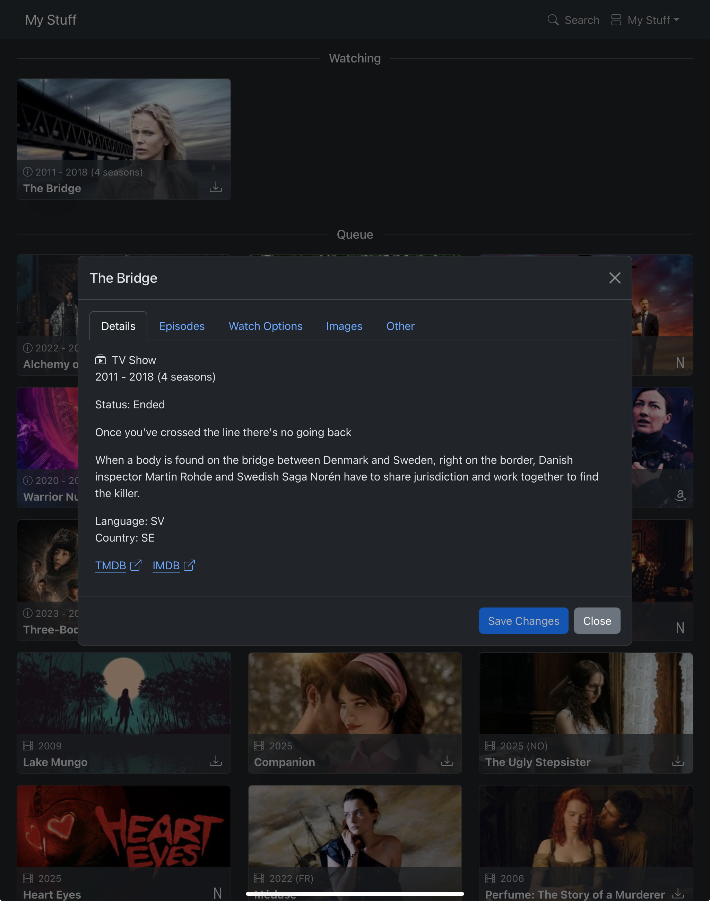
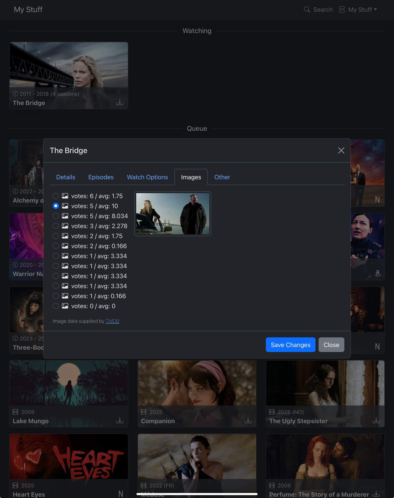

# Watch Board

A vertical kanban board for tv/movie watching

- multiple boards
- search via the TMDB API to add tv shows and movies
- drag items to reorder and move from list to list
- dialog with details, links to imdb, etc
- ability change the backdrop picture
- select which provider to watch on (netflix, amazon, home server, etc)

## Set Up

- Get an API token from the [TMDB developer site](https://developer.themoviedb.org/docs/getting-started).
- Create a config file with the token in it.
    - The directory of the config file is set using the environment variable `DATA_DIR`. It defaults to `$HOME/.config/watchboard/`

```shell
mkdir $HOME/.config/watchboard
echo "{ \"TmdbToken\": \"YOUR TMDB TOKEN HERE\" }" > $HOME/.config/watchboard/appsettings.json
```

## Run

Run the ./watchboard project. A sqlite database will be created and seeded in the `DATA_DIR` set above.

```shell
dotnet run --project watchboard
```

## Docker

The [docker compose](compose.yaml) + [docker](watchboard/Dockerfile) files will build an image and run it locally

```shell
docker compose up -d
```

To rebuild and rerun the app, remove the old image, build a new image, and start a container

```shell
docker compose down && docker rmi watchboard && docker compose up -d
```

## EF

When the EF models in the [Entities](watchboard/Database/Entities) directory change, create a new set of
migrations

```shell
DATA_DIR="." dotnet ef migrations add Notes \
--project watchboard/watchboard.csproj \
--configuration Debug \
--output-dir Database/Migrations
```

## js and css libs

*I took the simple approach here rather than using build tools.*

To get updated js and css libraries (like bootstrap), update npm packages and then copy the distributable files to
`./watchboard/wwwroot/lib/`.
There is a [helper script](./lib/copy-dist-libs.sh) to make it easier to copy the files.

## Screenshots





